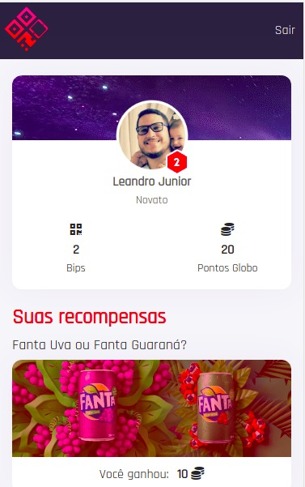
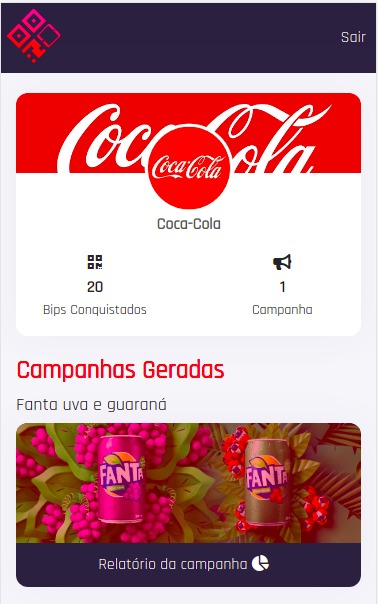
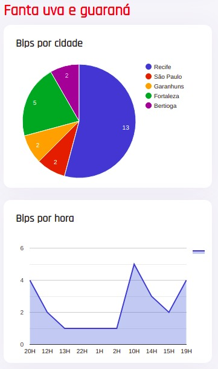
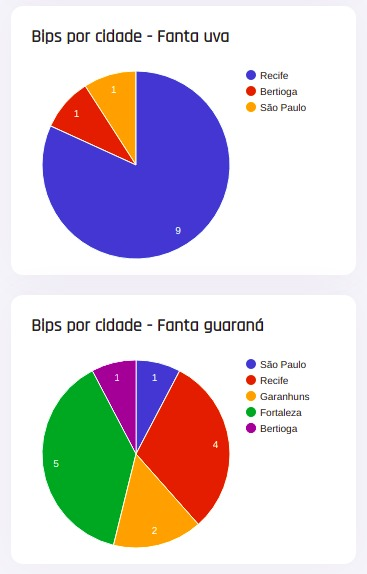

# Bem-Vindo a plataforma Bip Code

Para ter a experiência de utilizar nossa plataforma segue as informações necessárias:

### Passos para reproduzir a visão do telespectador interagindo com a plataforma:

>Abra o vídeo simulando propagandas em uma TV 
>URL: https://www.youtube.com/watch?v=BR8uoFtn_qU
- **OU** utilize a imagem abaixo como simulação de uma propaganda

Basta apenas apontar a câmera ou um leitor de QRCode de um smartphone e escolher o produto que você preferiu. Após isso você será redirecionado para plataforma e sua escolha será registrada.

### Passos para reproduzir a visão de um anunciante interagindo com a plataforma:

>Acessar: https://bip-code.netlify.com

Para realizar o login utilize seguintes informações:
| Login	| Password |
|--|--|
| coca | coca |
| pizza | pizza |

Será exibido o Dashboard do anuciante com suas campanhas

#### Escolhendo uma campanha será exibido o relatório com as seguintes informações:

- Bip por Cidade
- Bip por Horas

